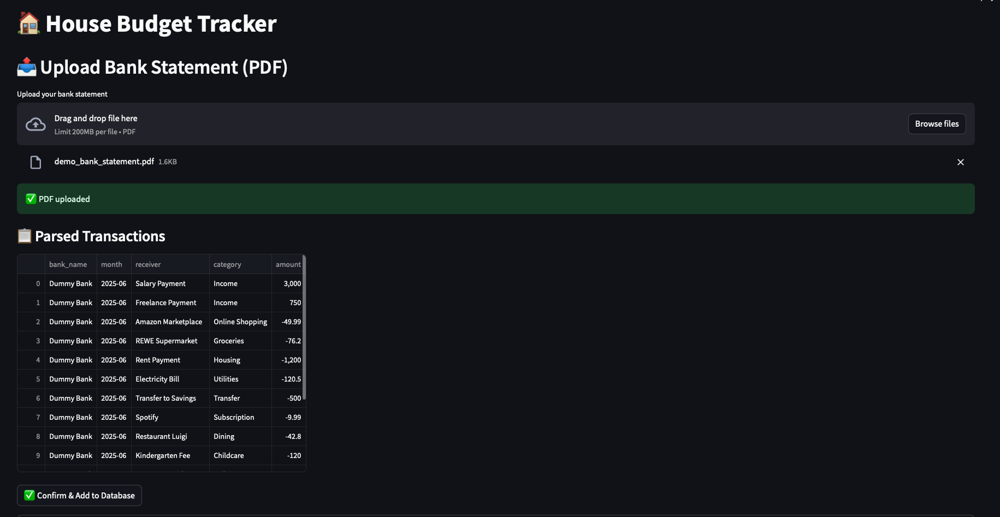
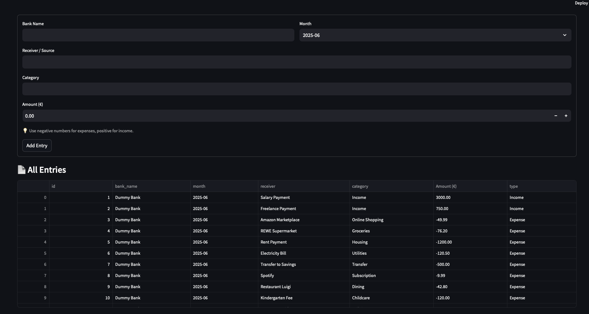
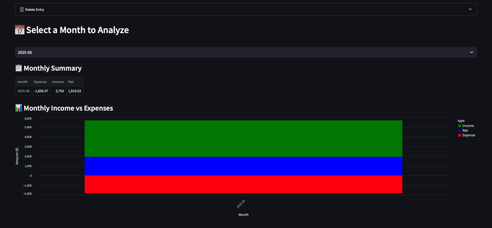
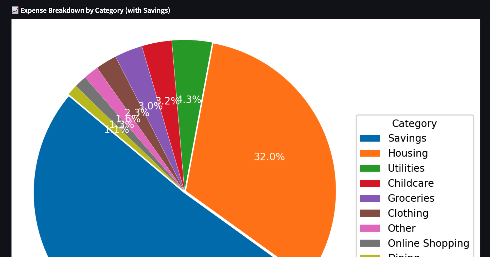
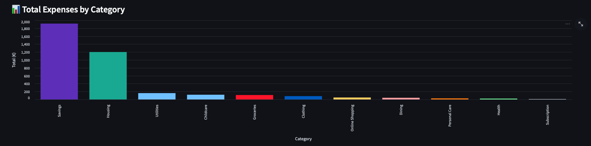

# 🏠 household_balance

A lightweight, local-first app for tracking and visualizing your household finances — built with Python, Streamlit, and GPT-4.

> ✨ Upload your bank statement PDF, let the app extract your transactions via LLM, and explore your finances with interactive charts.

---

## 📸 Demo Preview

<p align="center">
  
  <br/>
  <i>Upload your bank statement and let GPT-4 extract your transactions</i>
</p>

<p align="center">
  
  <br/>
  <i>Overview of parsed transactions</i>
</p>

<p align="center">
  
  <br/>
  <i>Main dashboard with income, expenses, and net balance</i>
</p>

<p align="center">
  
  <br/>
  <i>Category-level breakdown of expenses (with automatic transfer detection)</i>
</p>

<p align="center">
  
  <br/>
  <i>Total expense overview </i>
</p>

---

## 🔍 Features

✅ Upload or manually enter transactions  
✅ Monthly summary of income, expenses & net balance  
✅ Interactive pie and bar charts for insights  
✅ Intelligent detection of transfers between accounts  
✅ GPT-4 powered PDF parsing (RAG-style logic)  
✅ Track your savings and spending trends

---

## 🤖 Powered by LLMs

The app uses GPT-4 to interpret bank statements in PDF form:

- Extracts structured transactions (date, receiver, category, amount)
- Designed to be extendable to CSV, JSON, or raw email exports
- Easy to plug into any OpenAI-compatible model

---

## 🚧 Coming Soon

- 🧠 Auto-categorization of transactions  
- 🔁 Tagging and tracking of recurring expenses  
- 📈 Forecasting future balances  
- 🚨 Alerts for transaction anomalies  
- 💬 LangChain Q&A over your financial history

---

## 💻 Quick Start

```bash
# Clone the repo
git clone https://github.com/sertopexamgio/household_balance.git
cd household_balance

# Set up environment
python -m venv .venv
source .venv/bin/activate
pip install -r requirements.txt

# Add your OpenAI API key
export OPENAI_API_KEY="sk-..."

# Run the app
streamlit run app.py